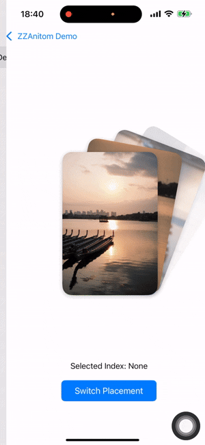
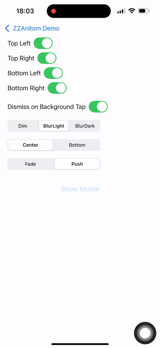
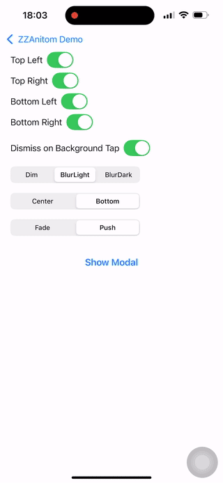

# ZZAnitom

A lightweight, pure-Swift animation framework that delivers stunning animations even on lower-end devices.

一个轻量级、纯 Swift 编写的动画框架，能够在低端设备上也呈现出惊艳的动画效果。


> ZZAnitom is a complete rewrite of my previous animation framework, [Anitom](https://github.com/weirui-kong/Anitom), which was based on SwiftUI and may not be suitable for applications targeting lower iOS versions.  
> By migrating to UIKit, ZZAnitom offers greater compatibility and easier integration across multiple platforms.  
> The migration is expected to be completed by June 2025.

Unlike solutions that hook into system methods, **ZZAnitom** relies solely on standard UIKit transitions and animations to achieve smooth, performant animations and an excellent user experience.

**Note:** Some use cases may require [SnapKit](https://github.com/SnapKit/SnapKit) for layout support.

---

## Example Usage 
### `ZZAImageStackView`

Here's a simple example demonstrating how to use `ZZAImageStackView`:




```swift
let stackView = ZZAImageStackView()

override func viewDidLoad() {
    super.viewDidLoad()
    
    stackView.frame = CGRect(x: 0, y: 0, width: 300, height: 400)
    stackView.center = view.center
    stackView.imageSize = CGSize(width: 200, height: 300)
    stackView.delegate = self
    stackView.images = [
        UIImage(named: "zzais_1")!,
        UIImage(named: "zzais_2")!,
        UIImage(named: "zzais_3")!,
        UIImage(named: "zzais_4")!
    ]
    view.addSubview(stackView)
}

func imageStackView(_ stackView: ZZAImageStackView, didTapImageAt index: Int) {
    selectedIndexLabel.text = "Selected Index: \(index)"
}
```

### `ZZAModalViewController`

Here's a simple example demonstrating how to use `ZZAModalViewController`, where you can use your custom content view:

| Center-Push | Center-Push |
|---|---|
|  |  |

```swift
let contentView = ZZAModalExampleContentView()
let modalVC = ZZAModalViewController(
    contentView: contentView,
    cornerMask: [.topLeft, .topRight, .bottomLeft, .bottomRight],
    dismissOnBackgroundTap: true,
    backgroundStyle: .blur(style: .light),
    placement: .center,
    animationStyle: .fade
)

contentView.onClose = { [weak modalVC] in
    modalVC?.dismissModal()
}

present(modalVC, animated: false)
```

> Note: You must override `intrinsicContentSize` to let the container know the size of your content view.

### `ZZAHapticsManager`
Here is a simple example demonstrating how to use ZZAHapticsManager for generating haptic feedback on various events.

```swift
// Simple
ZZAHapticManager.shared.play(.lightImpact)
// Continuous
ZZAHapticManager.shared.playContinuousVibration(duration: 2.0)
// Customized
ZZAHapticManager.shared.playCustomHaptic(intensity: 0.8, sharpness: 0.5, duration: 0.5)
```
